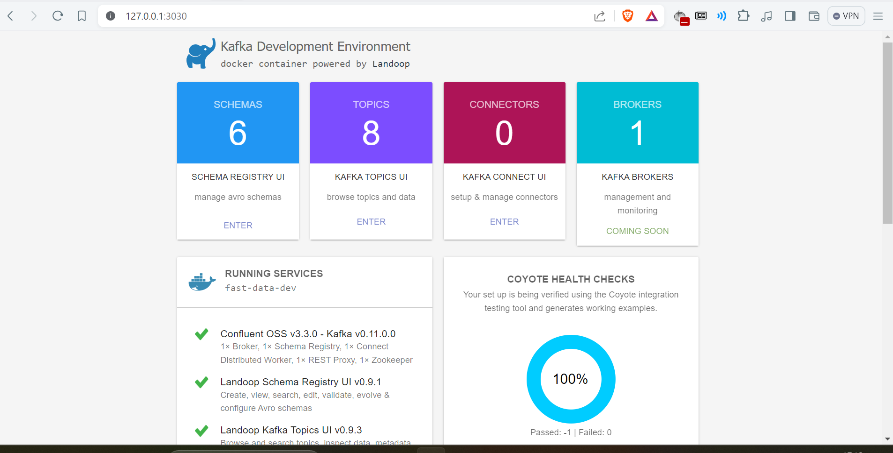
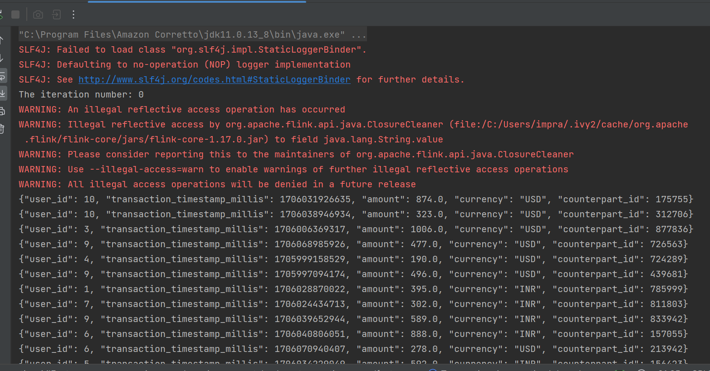

# RemoteBranchTechAssignment

# Real-Time Transaction Ingestion Pipeline

## Overview

This repository contains the implementation of a real-time data ingestion pipeline for `remotebank.io`, a digital bank. The pipeline is designed to compute the total number of financial transactions per user and expose this feature for use by the analytics and machine learning teams. The implementation leverages Apache Flink for event processing, Kafka for real-time data streaming, Elasticsearch for real-time aggregation results, and S3 for scalable storage.

## Table of Contents

1. [Assessment Context](#assessment-context)
2. [Architecture](#architecture)
3. [Setup Instructions](#setup-instructions)
4. [Components](#components)
    - [Kafka Cluster Setup](#kafka-cluster-setup)
    - [Transactions Producer](#transactions-producer)
    - [Transactions ML Features Job](#transactions-ml-features-job)
    - [Transactions Backup Job](#transactions-backup-job)
5. [Backfill Process](#backfill-process)
6. [Conclusion](#conclusion)

## Assessment Context

As a data engineer at remotebank.io, you are tasked with designing a data ingestion pipeline to compute the total number of financial transactions per customer in real time and expose this feature to the analytics team. This pipeline leverages Kafka for real-time data streaming, Flink for event processing, Elasticsearch for real-time aggregation, and S3 for scalable storage.

## Architecture

The architecture of the solution consists of the following components:

1. **Kafka Cluster**: Handles real-time streaming of transaction data.
2. **Schema Registry**: Manages schema validation and evolution.
3. **Transactions Producer**: Generates fake transaction data using Apache Flink and pushes it to the Kafka topic.
4. **Transactions Backup Job**: Consumes transactions related data from Kafka and persists it to S3 using Kafka Connect.
5. **Transactions ML Features Job**: Computes the total number of transactions per user using Flink and outputs the results to Elasticsearch for real-time access & S3 for batch processing

## Setup Instructions

To set up and run the project locally, follow these steps:

1. **Clone the Repository**
    ```bash
    git clone https://github.com/impraveenchand/RemoteBranchTechAssignment.git
    ```

2. **Build and Run the Docker Containers**
    ```bash
    docker-compose up -d
    ```

3. **Create Kafka Topics**
    - Create the `transactions` & `transactions-aggregation` topics with a 1-day retention period.
    ```bash 
    docker exec remotebanktechassignment-kafka-cluster-1 /bin/bash kafka-topics --create --zookeeper localhost:2181 --topic transactions --replication-factor 1 --partitions 2 --config retention.ms=86400000
   ```
   ```bash
    docker exec remotebanktechassignment-kafka-cluster-1 /bin/bash kafka-topics --create --zookeeper localhost:2181 --topic transactions-aggregation --replication-factor 1 --partitions 2 --config retention.ms=86400000
    ```
4. **Create the avro schemas on schema registry**
   http://127.0.0.1:3030/
   
    - Please open the url http://127.0.0.1:3030/schema-registry-ui/#/ and register the schemas for the transactions & transactions-aggregation topics as subjects transactions-key & transactions-value for transaction topic, transactions-aggregation-key & transactions-aggregation-value for transactions-aggregation topic. And, also you can find the .avsc files below
    
   ```
    modules/common/src/main/avro/transactionEventKey.avsc
    modules/common/src/main/avro/transactionEventValue.avsc 
    modules/common/src/main/avro/transactionAggregatedEventKey.avsc
    modules/common/src/main/avro/transactionAggregatedEventValue.avsc
   ```

5. **Run the Transactions Producer**
   - Open the project in IntelliJ IDEA.
   - Navigate to the TransactionsProducer module.
   - Run the Main class to start the transactions producer service.
   - This job will write events into `transactions` kafka topic.
   - 

6. **Run the Transactions ML Features Job**
   - Open the project in IntelliJ IDEA.
   - Navigate to the TransactionsMLFeatures module.
   - Run the Main class to start the transactions ML features service.
   - This job will write events into both elasticsearch & aggregated kafka topic
   - 

7. **The Transactions backup job & Transactions ML Features Job uses kafka connect for pushing events int S3 from both the kafka topics.**
    - I'm sharing the properties/json file structure for kafka connect job below
```json
{
      "connector.class": "io.confluent.connect.s3.S3SinkConnector",
      "s3.region": "ap-south-1",
      "partition.duration.ms": "3600000",
      "topics.dir": "prod/kafka_connect_events/",
      "flush.size": "5000000",
      "schema.compatibility": "BACKWARD",
      "s3.part.size": "134217728",
      "timezone": "UTC",
      "tasks.max": "1",
      "topics.regex": "^transactions|transactions-aggregation$",
      "locale": "en-US",
      "format.class": "io.confluent.connect.s3.format.parquet.ParquetFormat",
      "partitioner.class": "io.confluent.connect.storage.partitioner.TimeBasedPartitioner",
      "name": "ad-tech.ad-selection-ads-s3-sink",
      "errors.tolerance": "none",
      "errors.log.enable": "true",
      "storage.class": "io.confluent.connect.s3.storage.S3Storage",
      "rotate.schedule.interval.ms": "600000",
      "s3.bucket.name": "remote-bank-events",
      "path.format": "'dt='YYYY'-'MM'-'dd'/hr='HH",
      "timestamp.extractor": "RecordField",
      "timestamp.field": "transaction_timestamp_millis"
}
```
   

## Components

### Kafka Cluster Setup

- **Topic Creation**: The `transactions` topic is created with a 1-day retention period.
- **Partitioning Strategy**: Partition by `user_id` to ensure that all transactions of a user are processed sequentially.
- **Schema Registry**: Used to validate and manage the evolution of the transaction schema.

### Transactions Producer

This service uses Apache Flink to generate fake transaction data and publishes it to the `transactions` Kafka topic. The schema of the transactions is as follows:
```json
{
    "user_id": int,
    "transaction_timestamp_millis": long,
    "amount": float,
    "currency": string,
    "counterpart_id": int
}
```


### Transactions Backup Job

This consumer reads from the `transactions` Kafka topic and persists the data to S3 using Kafka Connect. The output format in parquet snappy enables scalable SQL queries via SparkSQL.

### Transactions ML Features Job

This consumer uses Flink to compute the total number of transactions per user and outputs the results in two ways:
1. **Elasticsearch**: For real-time access by the ML model for predictions.
2. **File-Based Storage**: The aggregated data will be pushed into s3 using kafka connect. For analytics and data science teams to build reports and train ML models.

The schema of the output events is:
```json
{
    "user_id": int,
    "total_transactions_count": int
}
```
- The events that are pushed into `transactions-aggregation` topic visible in the below image

- The events that are pushed into elasticsearch `transaction-aggregated-events` index visible in the below image


## Backfill Process

To backfill the transactions ML features using all historical data:
1. **Create a spark batch job**: Add the spark batch job to support a backfill mode where it processes historical data from S3 `s3://remote-bank-events/prod/kafka_connect_events/transactions/` to `s3://remote-bank-events/prod/kafka_connect_events/transactions-aggregation/`
2. **Backfill Mode**: When running in backfill mode, the spark batch job will read historical data from S3 instead of Kafka.


